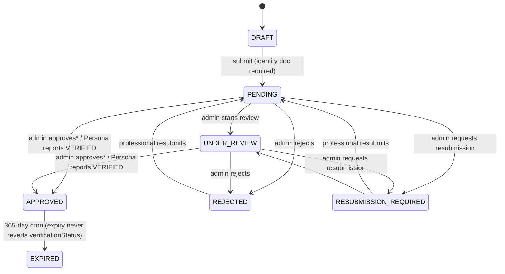

# Module 98 — Professional Tax & Business Verification Audit

**Scope:** Read-only architecture audit. No production code was modified. All file paths and line numbers below were read directly from the current state of the `maestroya-platform-auth` repository on 2026-09-06.

---

## 1. Executive Summary

MaestroYa already has a real, tested, non-trivial verification architecture: a case-based `ProfessionalVerification` state machine (Module 17), a Persona automated-identity integration bolted onto the same state machine (Module 59), a company mirror of the same pattern (`CompanyVerification`, Module 18), a separate "onboarding checklist" aggregate (`ProfessionalOnboarding`, Module 62), and — critically — a prior fix (referred to in code comments as "Module 74 — Business Registration Enforcement" and "Module 83 — Professional Verification Enforcement") that already requires a business-registration document before a solo professional's verification case can be **manually** approved, and that already wires `verificationStatus` into quote submission and discovery.

**The headline finding is not that the historical gap described in this module's brief is untouched — it is that it was already half-fixed, and the fix has a hole that has never been caught by any prior audit.** `ApproveProfessionalVerificationUseCase` (the human-admin approval path) enforces `hasBusinessRegistrationDocument` before allowing `APPROVED`. `RefreshVerificationStatusUseCase` (the Persona automated-approval path, driven by both the professional's own "check status" action and the Persona webhook) does **not** — it applies `APPROVED` purely from Persona's own identity-verification outcome, with no document check at all (`src/core/application/use-cases/verification/refresh-verification-status.use-case.ts:85-101`). Since `APPROVED` is the *only* thing gating quote submission (`ProfessionalProfile.verificationStatus === "VERIFIED"`, checked in `create-quote.use-case.ts:72`) and discovery (`prisma-professional-discovery-repository.ts:119-126`), a solo professional who completes Persona identity verification alone — with zero business or tax documents — becomes fully marketplace-eligible and payout-eligible today, with no code path that would ever require them to prove they are a registered autónomo or business. This is confirmed by the existing integration test suite itself: `tests/integration/verification/verification-flows.test.ts` has a test asserting the manual path "refuses to approve a case with no business-registration document" (line 225), while `tests/integration/verification/provider-verification-flows.test.ts` has the mirror-image test for the Persona path — "applies an APPROVED transition when the provider reports VERIFIED" (line 112) — with no equivalent business-registration assertion anywhere in that file.

Beyond that specific bypass, the current architecture only ever asks for a document called `BUSINESS_REGISTRATION` (professionals) or `BUSINESS_LICENSE`/`TAX_CERTIFICATE` (companies) — generic placeholders explicitly marked in code as "GESTOR DECISION PENDING" (`professional-verification-rules.ts:82-102`). There is no `MODELO_036`, `AEAT`, `CENSUS`, or `TAX_REGISTRATION` concept anywhere in the codebase (schema, domain, docs, or tests) — confirmed by an exhaustive repository-wide search. An admin reviewing a "BUSINESS_REGISTRATION" upload today is looking at an arbitrary file with no structural or automated validation of its content; the platform enforces *presence of a document*, not *evidence of tax/business registration*.

The `ProfessionalOnboarding` aggregate (Module 62) — which does model the intended richer rule (`IDENTITY_VERIFIED` **and** `BUSINESS_REGISTRATION_VERIFIED` **and** `PROFILE_COMPLETE` **and** `PAYOUT_CONNECTED` → `ACTIVATED`) — turns out not to be the thing that actually gates marketplace participation at all. It is a parallel, largely disconnected bookkeeping flow whose only observed consumer outside its own module is a payout-account convenience resolver, not quote/discovery eligibility. The real marketplace gate is the older, coarser `ProfessionalProfile.status`/`verificationStatus` pair. This is a "look for duplication" finding the brief specifically asked for: two independent "is this professional ready" concepts exist, they can disagree, and only one of them is actually enforced where it matters.

**Verdict up front:** the architecture is reusable and does not need a parallel verification system. The gap is real, narrow, and fixable without a redesign: (1) close the Persona-approval bypass, (2) decide and encode MaestroYa's own explicit autónomo/company document policy (Modelo 036 or equivalent) rather than the current placeholder, and (3) reconcile — or explicitly retire — the second onboarding-activation gate so it cannot silently diverge from the one that is actually enforced.

---

## 2. Current Architecture

| Concept | Model / File | Role |
|---|---|---|
| Solo professional's business record | `ProfessionalProfile` (`prisma/schema.prisma:1401`) | `status` (ACTIVE/INACTIVE/SUSPENDED, **defaults ACTIVE at creation**), `verificationStatus` (UNVERIFIED/PENDING/VERIFIED/REJECTED, the public trust badge and the actual marketplace gate), `taxId` (free-text, unique, never format/AEAT-validated) |
| Company's business record | `CompanyProfile` (`prisma/schema.prisma:1472`) | `status` (PENDING/ACTIVE/SUSPENDED/DEACTIVATED, **defaults PENDING**), `isVerified`/`verifiedAt`, `taxId` (CIF/NIF, unique, never format-validated) |
| Identity + business verification *case* (individual) | `ProfessionalVerification` + `ProfessionalVerificationDocument` (`prisma/schema.prisma:3024`, `:3092`) | Module 17/59/74/83's case-based state machine; carries both identity documents and the one business-registration document type in the same case |
| Identity + business verification *case* (company) | `CompanyVerification` + `CompanyVerificationDocument` (`prisma/schema.prisma:1613`, `:1643`) | Module 18's mirror of the above; for a company, the "identity" document *is* a business document (`BUSINESS_LICENSE`/`TAX_CERTIFICATE`) since there is no personal identity to check |
| Onboarding checklist | `ProfessionalOnboarding` (`prisma/schema.prisma:4446`) | Module 62's separate `IN_PROGRESS`/`ACTIVATED` aggregate; computes a 6-step checklist including `BUSINESS_REGISTRATION_VERIFIED`, but is not consulted by quote/discovery |
| Automated identity provider | `persona-verification-provider.ts`, `persona-client.ts`, `process-persona-webhook.use-case.ts` | Verifies *identity only* (a KYC/liveness template); has no concept of business or tax evidence |
| Admin review | `src/app/(dashboard)/admin/verifications/actions.ts` (professional), equivalent company actions | Role-gated Server Actions calling the same use cases as everything else |

Three genuinely distinct "is this professional trustworthy" fields coexist on `ProfessionalProfile` and its satellites, and it matters which one a given code path reads:

1. `ProfessionalProfile.status` — ACTIVE/INACTIVE/SUSPENDED. Defaults to **ACTIVE** the instant `CreateProfessionalUseCase` runs (`create-professional.use-case.ts:39-50`), i.e. at raw registration, before any verification exists.
2. `ProfessionalProfile.verificationStatus` — UNVERIFIED/PENDING/VERIFIED/REJECTED. Defaults UNVERIFIED; the *only* field the marketplace-facing code (`create-quote.use-case.ts`, `prisma-professional-discovery-repository.ts`) actually reads to decide eligibility. Written exclusively by `ApproveProfessionalVerificationUseCase`, `RejectProfessionalVerificationUseCase`, and `RefreshVerificationStatusUseCase` (Persona).
3. `ProfessionalVerification.status` (a different, case-level enum: DRAFT/PENDING/UNDER_REVIEW/APPROVED/REJECTED/RESUBMISSION_REQUIRED/EXPIRED) — the actual workflow the admin queue and Persona operate on; `APPROVED` here is what triggers writing `verificationStatus = VERIFIED` on the profile.
4. `ProfessionalOnboarding.status` (IN_PROGRESS/ACTIVATED) — a fourth, independent status that also depends on `ProfessionalVerification.status` plus three more conditions, but whose own `ACTIVATED` value is not read by anything that actually gates the marketplace.

---

## 3. Current Verification State Machine

`ProfessionalVerification.status` (`src/core/domain/services/professional-verification-rules.ts:14-22, 123-131`):



`*` = only the **manual/admin** approval path (`ApproveProfessionalVerificationUseCase`) enforces `hasBusinessRegistrationDocument` before allowing this transition. The **Persona/automated** path into the same `APPROVED` state (`RefreshVerificationStatusUseCase`) does not.

`CompanyVerification.status` (`VerificationCaseStatus`, `company-verification-rules.ts`) is an identical seven-state machine, entirely MANUAL (no provider concept exists on `CompanyVerification` at all), and *does* require a business document (`BUSINESS_LICENSE`/`TAX_CERTIFICATE`) at **submission** time (`submit-company-verification.use-case.ts:48-50`), not merely at approval — a stronger and more consistent gate than the individual-professional path.

`ProfessionalOnboarding.status` (`OnboardingStatus`: `IN_PROGRESS` → `ACTIVATED`) is a one-way, separate transition (`activate-professional.use-case.ts`) gated by `computeOnboardingProgress` (`professional-onboarding-rules.ts:192-214`), which itself reads `ProfessionalVerification.status`/document types as one of its four inputs.

---

## 4. Current Activation Flow

### Solo professional — what actually happens today

```
1. Registration ("Soy profesional") 
   → CompleteProfessionalOnboardingUseCase → CreateProfessionalUseCase
   → ProfessionalProfile created: status=ACTIVE, verificationStatus=UNVERIFIED
   → PROVIDER role granted immediately. No verification exists yet.
                        │
2. (Optional, professional-initiated) CreateProfessionalVerificationUseCase → DRAFT case
                        │
3a. MANUAL PATH                              3b. PERSONA PATH
    Upload ≥1 identity doc                       StartProfessionalVerificationUseCase
    → SubmitProfessionalVerificationUseCase      → creates Persona inquiry, case → PENDING
      (DRAFT→PENDING; only checks an             (no document requirement at all —
       identity doc, never a business doc)        Persona's own hosted flow collects
                        │                          identity evidence only)
    Admin StartReview → UNDER_REVIEW                          │
                        │                          Persona completes → webhook /
    ApproveProfessionalVerificationUseCase           professional's own "check status" 
      - checks hasBusinessRegistrationDocument       → RefreshVerificationStatusUseCase
        (Module 74/83) — THROWS                        - reads Persona's outcome only
          BusinessRegistrationRequiredError            - NO business-registration check
          if missing                                   - sets case APPROVED
                        │                                        │
      - sets case APPROVED                                       │
      - writes ProfessionalProfile.verificationStatus = VERIFIED (both paths, same write)
                        │
4. GATE: create-quote.use-case.ts:72 checks verificationStatus === "VERIFIED"
   GATE: discovery repo findActiveCandidatesByCategory/findCandidateById require
         status=ACTIVE AND verificationStatus=VERIFIED (Module 83, B2 fix)
   → professional can now be discovered and submit quotes
                        │
5. (Separately, optionally, never checked above) ActivateProfessionalUseCase
   requires ALL of: TERMS_ACCEPTED, PRIVACY_POLICY_ACCEPTED, IDENTITY_VERIFIED,
   BUSINESS_REGISTRATION_VERIFIED, PROFILE_COMPLETE, PAYOUT_CONNECTED
   → ProfessionalOnboarding.status = ACTIVATED — but nothing in step 4's gates
     reads this value.
```

**Missing/weak gates, marked explicitly:**

- ⚠️ Step 3b never requires a business/tax document at all before reaching the same `APPROVED` state step 4 rewards.
- ⚠️ Step 4's business-registration requirement (when it *is* enforced, i.e. only via 3a) is satisfied by the presence of one `BUSINESS_REGISTRATION`-typed file, not by any validated content — an admin's visual review is the entire check.
- ⚠️ Step 5's stronger, 6-step rule is never consulted by step 4 — a professional can be fully marketplace-active without ever touching the `ProfessionalOnboarding` flow.
- ⚠️ `ExpireProfessionalVerificationsUseCase` moves an old case to `EXPIRED` after 365 days but **by explicit documented design never reverts `verificationStatus`** (`expire-professional-verifications.use-case.ts:20-27`), so a professional verified via either path (including the Persona bypass) stays marketplace-eligible indefinitely even after their case — and any business evidence tied to it — is stale.

### Company — what actually happens today

```
1. CreateCompanyUseCase → CompanyProfile: status=PENDING, isVerified=false
2. CreateCompanyVerificationUseCase → DRAFT case
3. Upload documents; SubmitCompanyVerificationUseCase REQUIRES ≥1 of
   BUSINESS_LICENSE/TAX_CERTIFICATE at submission (stronger than the
   professional path — enforced before admin ever sees it, not only at approval)
4. Admin review → ApproveCompanyVerificationUseCase → case APPROVED,
   CompanyProfile.isVerified = true
5. ActivateCompanyOnVerificationApprovedSubscriber (event-driven, Module 83)
   auto-transitions CompanyProfile.status PENDING/SUSPENDED → ACTIVE
6. isCompanyDiscoverable(status) === (status === "ACTIVE") gates
   discovery/payout eligibility (check-payout-eligibility.use-case.ts)
```

The company path is architecturally cleaner and has no automated/Persona shortcut, so it does not share the professional path's bypass. Its gap is different: `BUSINESS_LICENSE`/`TAX_CERTIFICATE` are still generic placeholders, not a Modelo 036/AEAT-specific requirement, and — as this document is the company's *only* identity check — MaestroYa has no separate verification of the human representative signing on the company's behalf (out of this module's stated scope, but worth flagging under Autónomo/Company policy below).

---

## 5. Current Gap

Restating precisely, using current code as the source of truth rather than the historical audit findings:

1. **Confirmed still-open, previously undetected:** the Persona automated-approval path (`RefreshVerificationStatusUseCase`) can move a solo professional to full marketplace + payout eligibility using identity evidence alone, with zero business/tax document requirement — a complete bypass of the Module 74/83 business-registration gate that the manual path enforces. Evidence: `refresh-verification-status.use-case.ts:85-101` (no call to `hasBusinessRegistrationDocument` anywhere in the file, confirmed by `grep`), contrasted with `approve-professional-verification.use-case.ts:66-69` (which does call it and throws `BusinessRegistrationRequiredError`). Confirmed absent from test coverage: `tests/integration/verification/provider-verification-flows.test.ts` has no business-registration assertion; `tests/integration/verification/verification-flows.test.ts:225` has the equivalent assertion only for the manual path.
2. **Confirmed still-open:** no representation anywhere in the repository of Modelo 036, AEAT, "alta de autónomo," or any Spain-specific tax/census concept. `BUSINESS_REGISTRATION_DOCUMENT_TYPES` is a single generic placeholder explicitly marked `GESTOR DECISION PENDING` in its own doc comment (`professional-verification-rules.ts:82-105`).
3. **Confirmed still-open, architectural:** `ProfessionalOnboarding`'s richer activation rule (identity **and** business-registration **and** profile-complete **and** payout-connected) is not the thing enforced at the point of marketplace participation. Two independently-mutable "is this professional ready" signals exist and can diverge with no reconciliation.
4. **Confirmed still-open, minor:** an `APPROVED` verification case's business evidence is never re-checked; expiry doesn't revoke the profile's public `VERIFIED` badge (a pre-existing, documented Module 28 limitation, not new to Module 98, but directly relevant to "is the business/tax evidence still current").
5. **Partially resolved from the historical description:** the original brief's framing ("solo activation historically required only identity documents") is *no longer accurate* for the manual review path — Module 74/83 already added a business-registration requirement there. The gap is narrower than originally framed: it is a bypass in one specific code path, not an absent control.
6. **Not a gap:** company verification already requires a business/tax document (`BUSINESS_LICENSE`/`TAX_CERTIFICATE`) before a case can even be submitted, and already auto-activates on approval — this is stronger than the professional path and does not need Module 98 to fix it structurally (only to potentially align its document taxonomy per §8 below).

---

## 6. Proposed Module 98 Business Rule

Keep the existing state machine and vocabulary; add exactly one missing enforcement point and one policy decision. Do **not** introduce a parallel eligibility aggregate — reuse `ProfessionalVerification`/`CompanyVerification` and the existing document-type enum.

Separated by concern, as the brief requires:

- **Identity** ("is this person who they claim to be?") — already fully implemented via Module 17 (manual, `NATIONAL_ID`/`PASSPORT`/`DRIVER_LICENSE`) and Module 59 (Persona). No change needed.
- **Business** ("does this professional/business provide sufficient evidence to operate on MaestroYa?") — the proposed rule: **no `ProfessionalVerification` or `CompanyVerification` case may reach `APPROVED`, through any provider, without at least one document from an explicit, MaestroYa-defined business-evidence document-type set.** This closes finding §5.1 by making the check provider-agnostic — implemented once, in the shared state-transition boundary, rather than duplicated per-provider (see §10).
- **Tax** ("has the professional/business provided sufficient evidence of their tax/business registration status according to MaestroYa's own onboarding policy?") — the proposed rule: MaestroYa explicitly names which document type(s) satisfy this (candidate: a renamed/added `MODELO_036` or `TAX_REGISTRATION_CERTIFICATE` document type, configurable per §7/§8), rather than continuing to rely on the generic, undifferentiated `BUSINESS_REGISTRATION`/`TAX_CERTIFICATE` types that give a reviewer no signal about *what* they're supposed to be checking.
- **Legal compliance** ("what Spanish law requires") — explicitly out of scope for implementation; every legal-uncertainty item is listed in §19 rather than encoded as a hard rule.

The resulting rule, stated exactly as the brief's candidate form, is architecturally already half-true and should become fully true:

```
IDENTITY_VERIFIED AND BUSINESS_TAX_VERIFIED → PROFESSIONAL_ELIGIBLE_FOR_ACTIVATION
```

where `BUSINESS_TAX_VERIFIED` is defined as "the professional's/company's APPROVED verification case contains at least one document of a MaestroYa-configured business/tax evidence type" — the same shape `isBusinessRegistrationVerified` already uses, just enforced at every path into `APPROVED`, not only the manual one, and with a document-type list the business has actually decided on rather than a placeholder.

---

## 7. Autónomo Policy

| Requirement | Status |
|---|---|
| Identity verification (Persona or manual) | **Confirmed product requirement** — already implemented |
| Business/tax registration evidence before marketplace activation | **Confirmed product requirement** (Module 74/83 already built this for the manual path) — Module 98's job is closing the Persona bypass, not inventing the requirement |
| Modelo 036 (or equivalent census document) specifically | **Asesor guidance, not yet a confirmed product requirement.** The asesor-s suggestion ("MaestroYa collect Modelo 036 from professionals/promoters") is recorded in this module's brief but has no corresponding artifact anywhere in the repository — no document type, no field, no validation rule, no test. This is a genuine decision MaestroYa product/legal needs to make explicit, not something the current architecture already encodes under a different name. |
| Additional business evidence (IAE certificate, "alta de autónomo") | **Legal unknown** — explicitly flagged as undecided in the codebase's own comments (`professional-verification-rules.ts:83-89`) |
| Whether one generic document type or several specific ones should satisfy the requirement | Architecturally already supports either — `BUSINESS_REGISTRATION_DOCUMENT_TYPES` is a list, and `hasBusinessRegistrationDocument` treats it as "any one of these" — this is a one-line policy change once decided, not a schema change |

---

## 8. Company / SL Policy

| Requirement | Status |
|---|---|
| Identity verification of the representative signing for the company | **Not currently implemented separately.** `CompanyVerification` only verifies the *company's* documents (`BUSINESS_LICENSE`/`TAX_CERTIFICATE`); there is no requirement that the `CompanyMember`/owner submitting them also complete personal identity verification (Module 17/59) in their own right. This is a legitimate product-policy gap distinct from Module 98's professional-tax focus but adjacent enough to flag. |
| Company/business verification | **Confirmed product requirement, already implemented and enforced at submission time** (stronger than the professional path) |
| Tax registration evidence (CIF/NIF plus a Modelo 036/registration-equivalent document) | `taxId` (CIF/NIF) exists as a raw string field with **no format validation** (no CIF/NIF checksum validation found anywhere in `company-rules.ts`, contrast with the rigorous `isValidIban` in `professional-onboarding-rules.ts:246-261` which does implement a real checksum) and no requirement that the *uploaded document* correspond to that `taxId` in any way — an asesor/legal decision on whether cross-checking is required |
| Company registration evidence (Registro Mercantil, escritura) | **Legal unknown** — not distinguished from generic `BUSINESS_LICENSE` today; whether MaestroYa's policy should require a specific registration document type is undecided |

---

## 9. Schema Impact

**Reusable as-is, no duplication needed:**
- `VerificationDocumentType`/`VerificationDocumentStatus` enums (`schema.prisma:1077-1090`) — already shared between `ProfessionalVerificationDocument` and `CompanyVerificationDocument`.
- `ProfessionalVerification`/`ProfessionalVerificationDocument`, `CompanyVerification`/`CompanyVerificationDocument` models — no new tables required.
- `ProfessionalOnboarding`'s existing `BUSINESS_REGISTRATION_VERIFIED` step concept — reusable as the UI-facing checklist once its inputs are corrected (see §16).
- GDPR retry infrastructure (`storagePurgeStatus`/`storagePurgeAttemptCount`/etc. on `ProfessionalVerificationDocument`) — already fit-for-purpose for any new document type added under the same model.

**Possible additive changes (schema modification, not implementation — listed per the brief's read-only constraint):**
- Extend `VerificationDocumentType` with one or more explicit values (e.g. `MODELO_036`, or a more general `TAX_REGISTRATION_CERTIFICATE`) once the Gestor/legal decision in §7 is made — additive enum value, backward compatible, no migration risk to existing rows.
- Consider adding the same document-type enum value to `CompanyVerificationDocument`'s accepted set (`COMPANY_VERIFICATION_DOCUMENT_TYPE_VALUES` in `company-verification-rules.ts:26-37`) for consistency, since companies also have a census/tax-registration obligation distinct from `BUSINESS_LICENSE`.
- No new indexes are obviously required — `@@index([type])` already exists on both document tables (`schema.prisma:3115`, `:1666` equivalent) and would cover a query for "does this case have a tax-registration document."
- No change to `ProfessionalProfile`/`CompanyProfile` fields is required — `verificationStatus`/`status`/`isVerified` already capture the outcome; the fix is behavioral (which code paths are allowed to set them), not structural.

---

## 10. Activation Gate

**Recommendation: move the business-registration check out of `ApproveProfessionalVerificationUseCase` alone and into the single state-transition boundary both approval paths share** — i.e., enforce it wherever `ProfessionalVerification.status` is written to `APPROVED`, regardless of who/what triggers it. Concretely, this means adding the same `hasBusinessRegistrationDocument` check (or its future Modelo-036-aware successor) into `RefreshVerificationStatusUseCase`'s `nextStatus === "APPROVED"` branch (`refresh-verification-status.use-case.ts:89-95`), with a clear resulting behavior when a Persona-approved identity case lacks business evidence: the case should land in a state that still requires a business document before the professional is treated as fully eligible (e.g. don't advance `verificationStatus` to `VERIFIED` yet, or introduce a distinct "identity-only" sub-state) rather than silently granting full marketplace/payout eligibility. This is a domain-rule change, not a per-call-site patch — it belongs in `professional-verification-rules.ts` (a single new exported predicate both use cases call) so a third future provider can never reintroduce the same bypass.

**Every activation path that must use it:**
1. `ApproveProfessionalVerificationUseCase` — already correct, becomes the reference implementation.
2. `RefreshVerificationStatusUseCase` — the confirmed gap; used by both the professional's own "check status" button and the Persona webhook (`process-persona-webhook.use-case.ts`), so fixing it here closes both entry points at once.
3. `SynchronizeVerificationUseCase` (mentioned in `refresh-verification-status.use-case.ts`'s own doc comment as calling the same logic for batch sync) — inherits the fix automatically once it lives in the shared rule/use case rather than being duplicated.
4. Prefer enforcing this at the **domain/application layer** (inside the use case, backed by a pure predicate in `professional-verification-rules.ts`), exactly as the existing manual-path check already does — never only in the UI, and never only in `create-quote.use-case.ts`'s read-side gate, which is a consequence of the write-side state, not a substitute for guarding it there.

---

## 11. Admin Override Policy

**Documented today:** an admin can approve, reject, or request resubmission on any case via the Server Actions in `src/app/(dashboard)/admin/verifications/actions.ts`, each gated by `requireRole(ROLES.ADMIN, ROLES.SUPER_ADMIN)`, each deriving the acting admin's id from the session (never client input), each recorded via the existing `AuditLog`/`ProfessionalVerificationStatusChanged` event subscriber trail (`record-professional-verification-audit-log.subscriber.ts`). This *is* a form of override — an admin's judgment that a document set (including, in principle, a business document of dubious quality) is acceptable — but it is not a **silent bypass**: it requires an explicit role, is fully audited, and (for rejection/resubmission) requires a non-empty, length-bounded reason (`isValidReviewReason`, 10–1000 chars).

**No separate "override the business-registration requirement" mechanism exists** — an admin cannot approve a case that is missing a business document; `ApproveProfessionalVerificationUseCase` throws unconditionally (`BusinessRegistrationRequiredError`) with no admin flag to suppress it. This is safe and correct as-is; **Module 98 should not invent an override where none exists** (per the brief's explicit instruction), and should preserve this hard-stop behavior when closing the Persona-path gap in §10, rather than introducing a new override surface.

**Recommendation:** if a genuine business need for an exception ever arises (e.g. a legal-entity type the document taxonomy doesn't yet cover), it should follow the same shape already used elsewhere in this codebase for exceptional cases (explicit reason, `SUPER_ADMIN`-only, its own `AuditLogAction`), not a silent flag — but nothing in the current architecture suggests this is needed today.

---

## 12. Security Analysis

- **IDOR:** Verified clean on every path inspected. `RemoveVerificationDocumentUseCase` re-resolves the case from the caller's own `ProfessionalProfile` and returns `NotFoundError` (not `UnauthorizedError`, avoiding existence leakage) for a cross-owner document id (`remove-verification-document.use-case.ts:24-39`; the integration test `tests/integration/verification/verification-flows.test.ts:162` — "denies professional B removing professional A's document" — confirms this). `ResolvePayoutDestinationUseCase` is structurally IDOR-proof by unique-per-owner keys, not just a runtime check (`resolve-payout-destination.use-case.ts:26-33`).
- **Authorization:** Admin actions consistently call `requireRole(ROLES.ADMIN, ROLES.SUPER_ADMIN)` before any use case runs; professional actions call `requireAuth()` and never accept a client-supplied `professionalProfileId`/`verificationId` for "my own" operations.
- **Privilege escalation:** Not newly assessed here (Module 82's RBAC hardening is out of this module's scope), but nothing in the verification/onboarding surface reads a role or admin id from client input.
- **Client-controlled verification fields:** None found — `status`, `verificationStatus`, `reviewedByUserId`, etc. are always server-derived or use-case-computed, never accepted from a request body.
- **Document ownership:** Enforced in depth (see IDOR above); `fileUrl` is explicitly documented as never returned on any public API response (`schema.prisma:2979` region comment on `ProfessionalVerificationDocument`).
- **Rate limiting:** Document upload is rate-limited via `AntiAbuseService.enforceRateLimit("FILE_UPLOAD_BY_USER", ...)` (`verification/actions.ts:82-93`), a Module 33 fix explicitly noted as closing a prior "uploads were previously unrestricted in frequency" gap. Admin approval/rejection actions were not observed to be separately rate-limited, which is standard for low-volume authenticated-admin actions and not flagged as a finding.
- **Status transition authorization:** Every transition re-validates `canTransition`/`canApprove`/`canReject`/etc. server-side inside the use case, never trusting a client's claim about the current state (`ConflictError` thrown otherwise) — confirmed in both the professional and company flows.
- **Race conditions:** Not independently re-verified in this audit (would require the real-Postgres integration harness per §13), but the "at most one non-EXPIRED case" invariant is enforced by a partial unique index at the database layer per the schema comments, which is the correct place for it (not just an application-level check).
- **Replay/idempotency:** The Persona webhook path is idempotent via `ExternalWebhookEventRepository.claim()` before any side effect runs (`process-persona-webhook.use-case.ts:86-94`), with `FAILED` (and only `FAILED`) claims re-claimable — a sound, already-audited pattern (Module 70.1).
- **New risk introduced by the confirmed gap (§5.1):** this is itself a security-relevant finding, not just a business-policy one — it means the platform's own stated trust boundary ("verified professionals only may quote/be discovered/be paid") can be satisfied by an identity check alone, which is a weaker guarantee than the platform believes it has implemented and tested for the manual path.

---

## 13. GDPR Analysis

- **Document storage/deletion (professional path):** Thoroughly built — `ExecuteAccountErasureUseCase` soft-deletes `ProfessionalVerificationDocument` rows (`eraseDocumentsForProfessionalProfile`) and drives a durable, retryable Cloudinary purge with exponential backoff and a `DEAD_LETTER` state for operator review (Module 94, `schema.prisma:3092` region, `storagePurgeStatus`/`storagePurgeAttemptCount`/`storagePurgeNextAttemptAt`/`storagePurgeLastError`). This is genuinely production-grade and would extend cleanly to a new business/tax document type added to the same model — no new retry infrastructure needed.
- **Document storage/deletion (company path) — confirmed gap, not introduced by Module 98 but relevant to it:** `CompanyVerificationDocument` has **no** `deletedAt`, `storagePurgedAt`, or purge-retry columns at all, and `ExecuteAccountErasureUseCase` was confirmed by direct grep to contain zero references to `companyVerification`/`CompanyVerificationDocument`. A company's uploaded `TAX_CERTIFICATE`/`BUSINESS_LICENSE` files — which, once Module 98 broadens what "tax evidence" means, could include even more sensitive fiscal documents — currently have **no GDPR erasure path at all**. This predates Module 98 but a new, more sensitive document type should not be added to this model without first closing this gap.
- **Retention-policy unknowns:** How long a Modelo 036 or equivalent document must legally be retained (versus MaestroYa's own erasure obligations) is a genuine legal unknown — this audit does not invent a retention period, per instruction, and flags it in §19.
- **PII exposure:** Verification documents are already treated as sensitive (never on public APIs, access restricted to owner + ADMIN/SUPER_ADMIN) — a business/tax document is not meaningfully more sensitive than the existing `NATIONAL_ID`/`PASSPORT` documents from an access-control perspective, so no new exposure surface is anticipated from adding a document type to the *professional* model; the company-side gap above is the one that needs attention.

---

## 14. Observability

Already in place and reusable: `AuditLog`/`AuditLogAction.VERIFICATION`, the `ProfessionalVerificationStatusChanged`/`CompanyVerificationStatusChanged` domain events with their audit-log and notification subscribers, and `RefreshVerificationStatusUseCase`'s own best-effort audit-log write on every provider sync (including a `console.error`-logged failure path that doesn't roll back the state change).

**What Module 98 should add, if the activation-gate fix in §10 is implemented:**
- A distinct audit action/metadata value (or a new event) for "case reached provider-approved identity but is blocked pending business/tax evidence" — today there is no way to see, from the audit log, that this specific situation ever occurred, because it currently isn't distinguished from a normal `APPROVED`.
- A metric/counter for "Persona-approved cases missing business evidence" so product/ops can see the size of the population affected by the current gap before and after the fix ships.
- Extending `RecordProfessionalVerificationAuditLogSubscriber`'s existing metadata shape (already captures `provider`, `providerVerificationId`, `outcome`, `rawStatus`) with whichever new field the fix introduces, rather than a parallel logging path.

---

## 15. Test Plan

**Unit:**
- `professional-verification-rules.ts`: new predicate (e.g. `isBusinessTaxVerified`) covering "case approved via provider, no business document" → false; "case approved via provider, business document present" → true; keep 100% of the existing `hasBusinessRegistrationDocument`/`canTransition` coverage passing unchanged.
- `professional-onboarding-rules.ts`: extend `computeOnboardingProgress` tests once/if `BUSINESS_REGISTRATION_VERIFIED`'s definition changes to the new predicate.

**API/Use-case:**
- `RefreshVerificationStatusUseCase`: new test — "does not grant VERIFIED when Persona approves identity but no business document exists" (the direct regression test for §5.1's finding); "grants VERIFIED once a business document is present and Persona approves" (positive case). These belong in `tests/integration/verification/provider-verification-flows.test.ts`, mirroring the existing manual-path tests in `verification-flows.test.ts:225`.
- `ProcessPersonaWebhookUseCase`: confirm the fix applies identically via the webhook entry point, not only the professional's manual "check status" call.

**Security:**
- Re-run the existing IDOR test pattern (`tests/integration/verification/verification-flows.test.ts:162`) against any new document-type-specific action, if one is added.
- Confirm rate limiting still applies to uploads of the new document type (it will, automatically, since `FILE_UPLOAD_BY_USER` is type-agnostic).

**PostgreSQL integration (Module 91/92/96/97 harness):**
- Add the activation-gate fix's positive/negative cases to the existing real-Postgres verification suite rather than a new harness — the existing harness already exercises `ProfessionalVerification`/documents against a real local Postgres instance; extend it, do not replace it, and do not switch it to Supabase (explicit instruction).
- Concurrency: two near-simultaneous `RefreshVerificationStatusUseCase` calls (webhook + manual "check status" racing) for the same case — confirm the fix doesn't introduce a TOCTOU window between reading the document list and writing `APPROVED` (the existing partial-unique-index-backed "one active case" invariant should already prevent the dangerous version of this, but the document-presence check itself should be re-read inside the same transaction as the status write, not before it).

**GDPR:**
- Extend erasure tests to cover any new document type added under `ProfessionalVerificationDocument` (should pass unchanged given the existing generic purge-retry design).
- New test(s) for the `CompanyVerificationDocument` GDPR gap identified in §13, if that is addressed alongside Module 98.

---

## 16. Exact Implementation Plan

*Provided for planning purposes only — not to be executed in this read-only phase.*

| # | File / Path | Layer | Purpose | Depends on | Test coverage |
|---|---|---|---|---|---|
| 1 | `src/core/domain/services/professional-verification-rules.ts` | Domain | Add a provider-agnostic `isBusinessTaxVerified(status, documentTypes)` predicate (or rename/extend `isBusinessRegistrationVerified` and move it here from `professional-onboarding-rules.ts` so both the onboarding checklist and the approval gate read one definition) | none | Unit |
| 2 | `src/core/application/use-cases/verification/approve-professional-verification.use-case.ts` | Application | Switch to the shared predicate from #1 (behavior-preserving refactor) | 1 | Existing integration test must keep passing unchanged |
| 3 | `src/core/application/use-cases/verification/refresh-verification-status.use-case.ts` | Application | In the `nextStatus === "APPROVED"` branch, call the same predicate; if false, do not write `verificationStatus = VERIFIED` — instead keep the case in a state that still requires business evidence (exact resulting status/UX is a product decision deferred to whoever implements this) | 1 | New integration tests, §15 |
| 4 | `src/core/domain/services/professional-onboarding-rules.ts` | Domain | Update `isBusinessRegistrationVerified` to delegate to #1's shared predicate rather than duplicating the same two-line check, closing the "two definitions of the same rule" duplication risk | 1 | Existing unit test suite |
| 5 | `prisma/schema.prisma` — `VerificationDocumentType` enum | Data | Add the Gestor/legal-decided tax-evidence document type(s) (e.g. `MODELO_036` or `TAX_REGISTRATION_CERTIFICATE`) — additive only | Legal/Gestor decision (§7, §19) | N/A (enum-only migration) |
| 6 | `professional-verification-rules.ts` / `company-verification-rules.ts` | Domain | Add the new type to `BUSINESS_REGISTRATION_DOCUMENT_TYPES`/`COMPANY_VERIFICATION_DOCUMENT_TYPE_VALUES` once #5 lands | 5 | Unit |
| 7 | `record-professional-verification-audit-log.subscriber.ts` | Application | Extend metadata to capture the new "blocked pending business evidence" outcome for observability (§14) | 3 | Unit |
| 8 | GDPR: add `deletedAt`/purge-tracking columns to `CompanyVerificationDocument`, wire into `ExecuteAccountErasureUseCase` | Data + Application | Close the pre-existing company-document GDPR gap (§13) before broadening what documents companies upload | none (independent of the rest) | Integration, GDPR suite |

No use case, repository, or route needs to be created from scratch — every change above is a modification to an existing, already-tested file, matching the brief's "prefer wiring/reusing, never a parallel verification system" instruction.

---

## 17. Risk Assessment

| Finding | Severity | Why |
|---|---|---|
| Persona automated-approval path bypasses the business-registration requirement (§5.1) | **High** | Directly undermines the platform's own documented trust boundary ("unverified professionals cannot quote/be discovered" — Module 83's own stated objective); silently and completely defeats a control the manual path already enforces and tests for; currently exploitable by any professional who chooses the Persona flow instead of the manual one. Not rated Critical only because it does not expose data, enable privilege escalation, or affect money movement directly by itself — it is a business-rule bypass, not a security breach in the IDOR/authz sense. |
| No Modelo 036/AEAT-specific document type; generic placeholder only (§5.2) | **Medium** | This is a known, explicitly-flagged-in-code limitation awaiting a business/legal decision, not an oversight — the architecture already supports adding it in one line once decided. Severity reflects the product gap, not an engineering defect. |
| Two independent, potentially-divergent "activation" concepts (`verificationStatus` vs. `ProfessionalOnboarding.status`) (§5.3) | **Medium** | Confusing rather than immediately exploitable, but a real duplication risk: a future engineer could reasonably assume gating `ProfessionalOnboarding.status` also gates the marketplace, and be wrong. |
| `CompanyVerificationDocument` has no GDPR erasure path (§13) | **Medium** | Pre-existing, not introduced by this module's territory, but directly relevant since Module 98 would add more sensitive fiscal documents to the platform's surface. |
| Expired verification cases never revert the public `VERIFIED` badge (§5.4) | **Low** | Pre-existing, explicitly documented Module 28 product decision, not a Module 98 defect — but it compounds the business-evidence-staleness concern once business/tax evidence is added to what "VERIFIED" is supposed to mean. |
| `taxId`/CIF-NIF fields have no format validation | **Low** | Cosmetic/data-quality risk today; would matter more if Module 98 ever cross-checks an uploaded document's claimed tax ID against this field. |

**Zero Critical findings** in the areas this audit examined — no IDOR, no privilege escalation, no unauthenticated access, no data exposure was found in the verification/onboarding/admin surface.

---

## 18. Production Readiness Impact

The 2026-09-02 baseline of 88/100 already reflects a codebase where B2 (the original "unverified professionals can quote" blocker) has been fixed and B1/B3–B6 addressed by Modules 82–97. Module 98, as scoped by this audit, is a **narrower, high-value hardening pass on top of an already-shipped control**, not a from-scratch feature. Its realistic contribution to the score:

- Closing the confirmed Persona bypass (§5.1) directly strengthens the trust-and-safety category the 08-29/09-01 audits weighted heavily — this is the kind of finding that would have been flagged as a High/Blocker if it had been caught during Module 83's own review, so fixing it now recovers ground the platform doesn't know it's currently missing rather than adding new ground.
- Adding an explicit tax-document type is a product/compliance improvement more than a score-moving engineering one — it makes an existing "structurally safe, business-meaning undefined" placeholder into a real business rule.
- This audit does **not** estimate a specific point delta (e.g. "+3") — the brief explicitly warns against inflating the score, and the honest position is that closing one confirmed High-severity bypass plus one Medium-severity GDPR gap in an already-88 codebase is worth a modest, single-digit improvement once implemented and verified against the real-Postgres harness, contingent on no new findings surfacing during implementation.

---

## 19. Legal Assumptions & Unknowns

Everything below requires asesor/abogado confirmation before being encoded as a hard platform rule — none of it is assumed true by this audit or should be assumed true by whoever implements Module 98:

- **Exact document(s) required for an autónomo:** whether Modelo 036 alone suffices, whether "alta de autónomo" or an IAE certificate should also/instead be required, and whether requirements differ by activity type (`epígrafe`).
- **Exact document(s) required for a company/SL:** whether `BUSINESS_LICENSE`/`TAX_CERTIFICATE` as currently named actually correspond to a real Spanish document, or whether a specific `escritura de constitución` / `Registro Mercantil` extract / company-level Modelo 036 equivalent is legally expected.
- **Retention periods:** how long tax/business documents must be retained under Spanish tax/administrative law versus MaestroYa's own GDPR erasure obligations — this audit deliberately does not propose a number.
- **Legal validity of self-uploaded documents:** whether an admin's visual review of an uploaded file is sufficient evidence of registration, or whether any form of third-party verification (AEAT lookup, a compliance vendor) would eventually be legally expected — no such integration exists today and none is proposed here.
- **Company/SL specific requirements:** whether the *representative* signing on behalf of a company legally needs their own identity verification distinct from the company's own documents (§8).
- **Self-billing/invoicing matters:** explicitly out of scope per this module's own constraint — Module 98 must not touch `SelfBillingAuthorization` or invoicing, and this audit did not analyze that model beyond confirming its existence.
- **Whether MaestroYa's own onboarding policy (as opposed to a legal requirement) should be stricter than the law requires:** a product decision, not a legal one, but one the current code's own comments (`GESTOR DECISION PENDING`) show has not yet been made even at the product level.

---

## 20. Final Recommendation

1. **Is the current architecture reusable?** Yes, entirely. `ProfessionalVerification`/`CompanyVerification`, their document models, the Persona port, the admin review Server Actions, the audit-log/event-subscriber pattern, and the GDPR purge-retry infrastructure (for the professional side) are all sound, tested, and require no redesign.
2. **What must change?** The single behavioral gap in §5.1/§10 (Persona-approval path must enforce the same business-evidence check the manual path already does), plus an explicit product/legal decision on the document taxonomy in §7/§8/§19, encoded as an additive enum change per §9.
3. **What should NOT change?** The state machines themselves (`ProfessionalVerificationStatus`/`VerificationCaseStatus`), the document model shape, the admin authorization pattern, the event/audit-log wiring, the GDPR retry mechanism for professional documents, the company activation subscriber, and — per explicit instruction — Module 97's tax/IVA calculation and any self-billing/invoicing logic.
4. **What is the minimum safe implementation?** Item #3 alone from §16 (add the missing check to `RefreshVerificationStatusUseCase`) is the minimum change that closes the one confirmed exploitable gap, and can ship independently of the Modelo 036 product decision — it works today using the existing generic `BUSINESS_REGISTRATION` type, and simply needs the new type swapped in later per §6 (already a one-line change by design).
5. **What should be deferred to legal/contractual modules?** The exact Spanish-law-mandated document list (§19), any AEAT/third-party verification integration, self-billing agreements (explicitly excluded by this module's own brief), and the representative-identity-for-companies question in §8.

---

## Audit Verdict

### READY WITH CONDITIONS

**Must change**
- Close the Persona/automated-approval business-registration bypass in `RefreshVerificationStatusUseCase` (§5.1, §10, §16 item 3) — this is the one confirmed, currently-exploitable gap.
- Deduplicate the business-registration predicate so `professional-onboarding-rules.ts` and `professional-verification-rules.ts` share one definition (§16 item 4) — prevents the two "activation" concepts from silently disagreeing further.

**Must not change**
- The existing `ProfessionalVerification`/`CompanyVerification` state machines, document models, admin RBAC pattern, event/audit-log subscribers, and the professional-side GDPR Cloudinary purge-retry mechanism.
- Module 97's tax/IVA calculation logic.
- Any self-billing/invoicing behavior (explicitly out of scope).

**Requires legal/asesor confirmation**
- Which specific document(s) (Modelo 036, IAE certificate, "alta de autónomo," or other) satisfy the autónomo business/tax requirement.
- Which specific document(s) satisfy the company/SL requirement, and whether the current `BUSINESS_LICENSE`/`TAX_CERTIFICATE` naming maps to real Spanish documents.
- Retention periods for these documents once collected.
- Whether a company representative needs independent identity verification.

**Deferred**
- Any AEAT/third-party document-validation integration.
- The `CompanyVerificationDocument` GDPR erasure gap (§13) — pre-existing, adjacent, worth fixing but not blocking Module 98's core objective.
- `taxId`/CIF-NIF format validation.
- Self-billing/legal agreements (explicitly excluded).

**Again: this audit made no code changes.** No source files, migrations, tests, or configuration were modified — only read, searched, and analyzed, per the module's read-only instruction.
